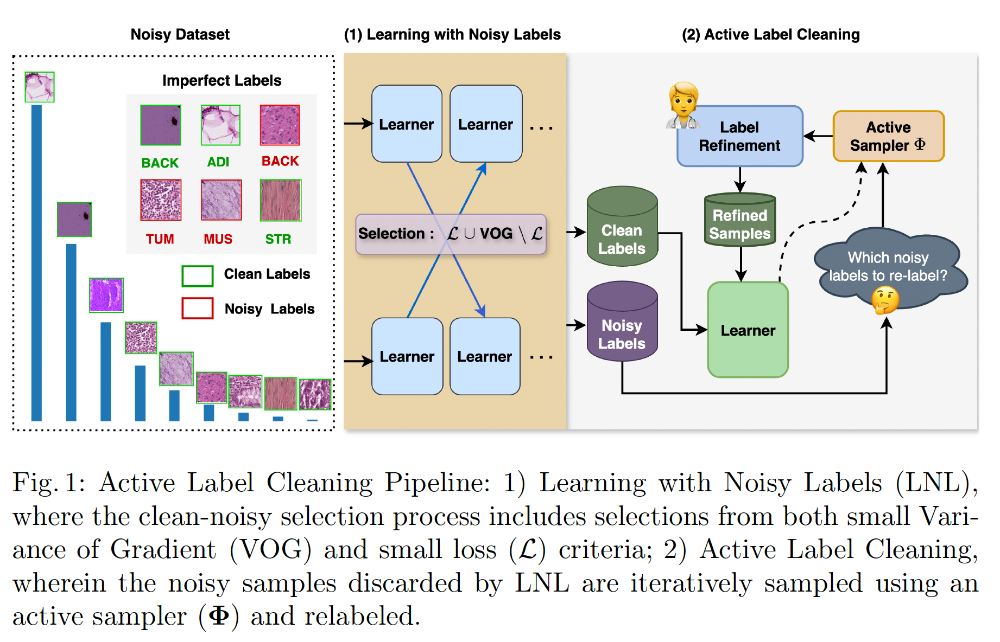

This contains source for our MICCAI 2024 paper title "Active Label Refinement for Robust Training of Imbalanced Medical Image Classification Tasks in the Presence of High Label Noise"

## Abstract ##
The robustness of supervised deep learning-based medical image classification is significantly undermined by label noise in the training data. Although several methods have been proposed to enhance classification performance in the presence of noisy labels, they face some challenges: 1) a struggle with class-imbalanced datasets, leading to the frequent overlooking of minority classes as noisy samples; 2) a singular focus on maximizing performance using noisy datasets, without incorporating experts-in-the-loop for actively cleaning the noisy labels. To mitigate these challenges, we propose a two-phase approach that combines Learning with Noisy Labels (LNL) and active learning. This approach not only improves the robustness of medical image classification in the presence of noisy labels but also iteratively improves the quality of the dataset by relabeling the important incorrect labels, under a limited annotation budget. Furthermore, we introduce a novel Variance of Gradients approach in the LNL phase, which complements the loss-based sample selection by also sampling under-represented examples. Using two imbalanced noisy medical classification datasets, we demonstrate that our proposed technique is superior to its predecessors at handling class imbalance by not misidentifying clean samples from minority classes as mostly noisy samples.

## Pipeline ##




## Installation
1. Clone the repository:
    ```bash
    git clone https://github.com/Bidur-Khanal/imbalanced-medical-active-label-cleaning.git
    cd imbalanced-medical-active-label-cleaning
    ```

## Usage
To use this tool, you need to run the `main_active_learning.py` script with the appropriate command-line arguments.

### Command Line Arguments
Here are the command-line arguments you can use with `main_active_learning.py`:

- `--dataset`: Specify the dataset to use (choices: "isic", "drd", "kvasir", "imbalanced_histopathology").
- `--corrupt_prob`: Probability by which the labels are corrupted.
- `--uncorrupt_classes`: List of classes that you don't want to corrupt.
- `--LNL_epochs`: Number of epochs to train the LNL method.
- `--batch`: Mini-batch size.
- `--lr_LNL`: Initial learning rate for LNL.
- `--lr_AL`: Initial learning rate for active learning.
- `--pretrained_model`: Use a pretrained model or not.
- `--label_cleaning_rounds`: Number of rounds to reach the budget.
- `--recalibration_epochs`: Number of epochs to train on cleaned examples before another phase of active label cleaning.
- `--active_selection_method`: Active learning method (choices: "random", "entropy_sampling", "least_confidence_sampling", "margin_sampling", "BALD_sampling", "coreset_sampling").
- `--round_budget`: Increase the annotation budget by this amount.
- `--label_cleaning`: Clean the labels or not.
- `--use_LNL_cleaned_labels`: Use the clean labels guessed by LNL as true labels.
- `--seed`: Seed for initializing training.
- `--method`: Method to use (choices: "coteaching", "coteaching_VOG", "cross_entropy", "scratch").
- `--mix_ratio`: Mix ratio for loss and VOG selection. 0 means use only loss and 1 means use only VOG selection.
- `--all_activations`: Compute gradients of all softmax activations with respect to inputs.
- `--active_learning_only`: Start relabeling from scratch, similar to active learning only (usually not used)
- `--scratch_after_LNL`: Restart training from scratch using the labels guessed as clean by LNL.

## Examples
Here is an example command to run the tool:
```bash
python main_active_learning.py --dataset imbalanced_histopathology --corrupt_prob 0.8 --uncorrupt_classes 9 --LNL_epochs 50 --batch 256 --lr_LNL 0.01 --lr_AL 0.01 --pretrained_model pretrained --label_cleaning_rounds 9 --recalibration_epochs 25 --active_selection_method entropy_sampling --round_budget 70 --label_cleaning True --use_LNL_cleaned_labels True --seed 0 --method coteaching_VOG --mix_ratio 0.2
```

*Note: ```uncorrupt_classes``` specififies which class is not altered (useful for inducing noise only in certain classes). For unifrom noise, please use use ```--uncorrupt_classes = <no. of classes```, Example: for ISIC 2019 ```-- uncorrupt_classes = 8```*


## Neptune.ai ##

Make sure you have an account at Neptune.ai to track the experiments. In ```main_active_learning.py``` replace ```Project-Name``` and ```Your API token``` with you Neptune project name and account API key, respectively.
```
run = neptune.init_run(project="Project-Name", api_token= "Your API token",)
```
